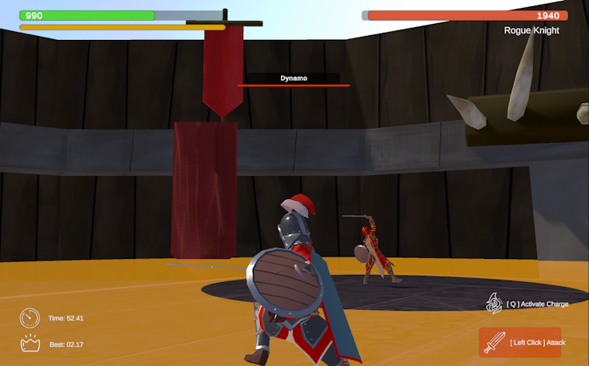

# Duel Blades

Clash sword against sword with the boss and come out on top!

- Includes a hard mode with no telegraphs and boss dealing higher damage, as well as a fun "water" mode.

### Controls
- WASD - Movement
- Mouse - Look Around
- Left Click - Attack
- Space - Jump
- Q - Activate Charge (x2 damage while active)
- ESC - Pause

### Assets
- Arena - https://assetstore.unity.com/packages/3d/environments/fantasy/low-poly-gladiators-arena-167116
- Some third person animations
    - https://assetstore.unity.com/packages/p/starter-assets-thirdperson-updates-in-new-charactercontroller-pa-196526
    - https://assetstore.unity.com/packages/3d/animations/rpg-character-mecanim-animation-pack-free-65284
- One particle effect - https://assetstore.unity.com/packages/3d/environments/historic/voxel-castle-pack-lite-164189
- Skybox - https://assetstore.unity.com/packages/p/10-skyboxes-pack-day-night-32236
- Floor Pattern - From Final Fantasy XIV's Eden Cloud of Darkness raid
- UI Icons - Various sources from Icons8
- Music - Final Fantasy VIII, XVI and https://www.youtube.com/watch?v=lmxZ_RaA6Ew